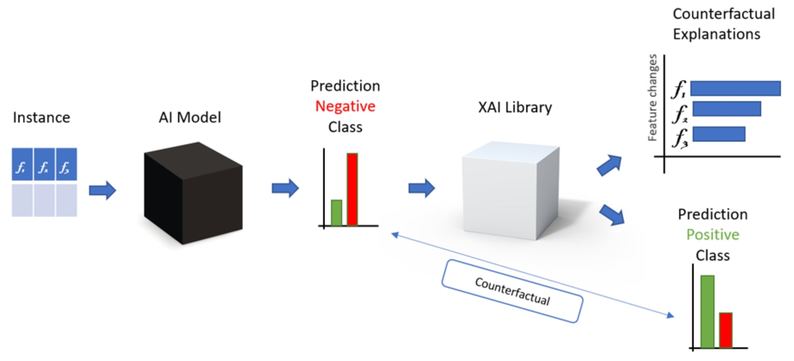

# Counterfactuals for Customer Churn Prediction

This project demonstrates the use of **counterfactual explanations** for predicting customer churn in an online retail business. By leveraging explainable AI (XAI) techniques, the project provides actionable insights for reducing churn and improving customer retention. The approach combines machine learning with the generation of diverse counterfactuals to understand what changes in customer behavior could have prevented churn.




## Features
- Data preprocessing and feature selection.
- Building and fine-tuning machine learning models for churn prediction.
- Generating counterfactual explanations using the **DiCE** library.
- Insights from aggregated counterfactual trends to guide business strategies.

## Files
1. **online_retail_customer_churn.csv**: The CSV file containing customer data for churn prediction.
2. **Main_Notebook.ipynb**: Jupyter Notebook with the full implementation, including:
   - Data preparation and modeling.
   - Model evaluation metrics.
   - Counterfactual generation and analysis.

## Usage
1. Clone this repository:
   ```bash
   git clone https://github.com/aghakishiyeva/Counterfactuals-For-Customer-Churn-Prediction
   cd Counterfactuals-For-Customer-Churn-Prediction

2. Open the Jupyter Notebook and run it step-by-step to explore the project.
